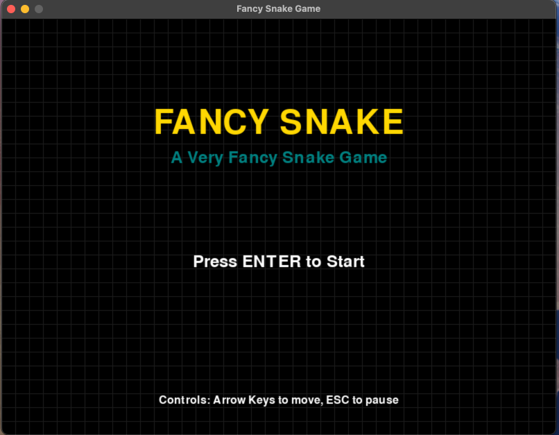
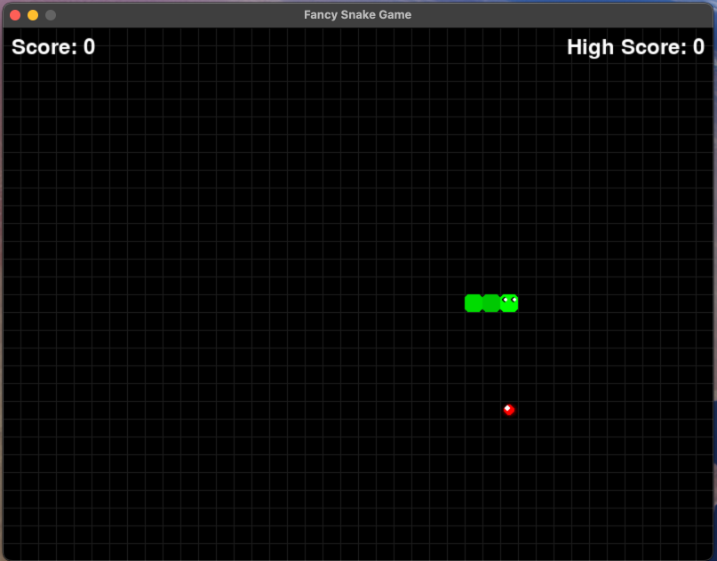

"""
Fancy Snake Game Generate by AI - README

A very fancy implementation of the classic Snake game with modern graphics,
special effects, and advanced gameplay features.
"""

# Fancy Snake Game

## Overview
This is a modern, visually appealing implementation of the classic Snake game with numerous
advanced features and fancy visual effects. The game offers multiple game modes, difficulty
levels, power-ups, and beautiful graphics with particle effects.

## Features

### Core Gameplay
- Classic snake movement and growth mechanics
- Collision detection with walls, obstacles, and self
- Score tracking and high score saving

### Visual Elements
- Custom snake graphics with gradient colors and animations
- Fancy food items with glow effects and different types
- Beautiful starry background with subtle grid
- Particle effects for movement, collisions, and food collection
- Smooth animations throughout the game

### Advanced Features
- Sound effects and background music
- Power-up system with 6 different types:
  - Speed Boost: Move 50% faster
  - Slow Motion: Move 50% slower
  - Ghost Mode: Pass through walls and yourself
  - Double Points: Score twice as many points
  - Magnet: Attract food items
  - Size Down: Reduce snake length by half
- Multiple game modes:
  - Classic: Traditional snake gameplay
  - Time Trial: Score as many points as possible before time runs out
  - Obstacle: Navigate around obstacles while collecting food
  - Maze: Find your way through a maze to collect food
  - Zen: Relaxed gameplay with no death, just enjoy growing
- Four difficulty levels (Easy, Medium, Hard, Extreme)

## Controls
- Arrow keys: Control snake direction
- Enter: Select/Confirm
- Escape: Pause/Return to menu
- Space: Quick start (from main menu)

## Requirements
- Python 3.6 or higher
- Pygame 2.0 or higher

## Installation

1. Ensure you have Python installed on your system
2. Install Pygame if you don't have it already:
   ```
   pip install pygame
   ```
3. Download the game files
4. Run the game:
   ```
   python fancy_snake_game.py
   ```

## Game Structure

The game is organized into several modules:

- `fancy_snake_game.py`: Main game file that integrates all components
- `visual_elements.py`: Enhanced visual elements (snake, food, particles, background)
- `sound_manager.py`: Sound effects and background music
- `power_ups.py`: Power-up system with different types and effects
- `game_modes.py`: Different game modes and difficulty settings

## Credits
Created by Manus AI as a demonstration of a fancy Snake game implementation.

Enjoy the game!

## IMG

### main home

 


### run



